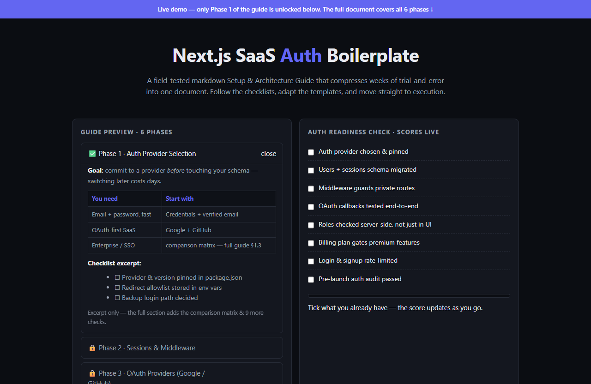

# Next.js SaaS Auth Boilerplate — live demo

  

  <a href="https://amos-mig.github.io/nextjs-saas-auth-boilerplate-demo/"><strong>▶ Open the live demo</strong></a> ·
  <a href="https://amosmign.gumroad.com/l/nextjs-saas-auth-boilerplate"><strong>Get the full product · €7</strong></a>

## What this is

An interactive teaser for the Next.js SaaS Auth Boilerplate setup guide: Phase 1 is fully readable, the other five phases sit behind locked rows, and a live-scoring Auth readiness checklist proves the guide's checklist-driven approach. The demo works entirely in-browser and clearly gates the full six-phase document behind the purchase CTA.

**Try it:** Tick off items in the Auth readiness check to watch your score and next-gap hint update live, then click the locked phase rows to see what's held back for the full guide.

## What you get in the full product

- Step-by-step structure — know exactly what to do next
- Checklists and tables you can fill in and reuse
- Written from real-world practice, not theory
- Instant digital download — read it in any markdown viewer or Notion

## About

- **Storefront:** [kits.amosmignery.dev](https://kits.amosmignery.dev) — single-file products, instant download, commercial license
- **Checkout:** [Gumroad](https://amosmign.gumroad.com/l/nextjs-saas-auth-boilerplate) (Merchant of Record, VAT handled)
- **Full product:** [Next.js SaaS Auth Boilerplate](https://amosmign.gumroad.com/l/nextjs-saas-auth-boilerplate) · €7

## License

The demo page in this repo is MIT-licensed — reuse the technique, not the product.
The **Next.js SaaS Auth Boilerplate** itself is not included here and is not free software.
